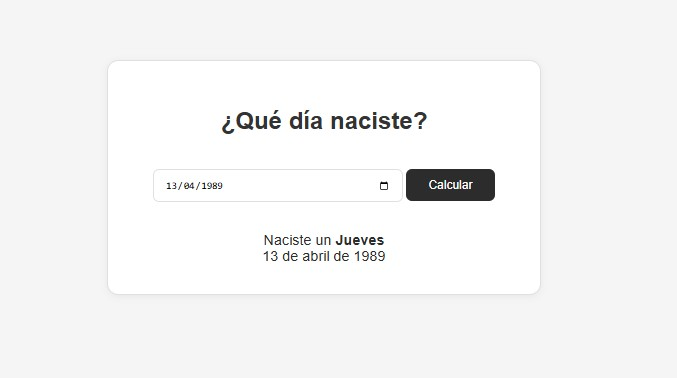

# Calculadora de Día de Nacimiento 📅

## Descripción
Aplicación web minimalista que permite calcular el día de la semana en que naciste ingresando tu fecha de nacimiento. La herramienta valida la fecha y muestra el resultado de forma clara y amigable.

## Características 🌟
- **Cálculo preciso**: Usa fechas UTC para evitar errores de zona horaria
- **Interfaz limpia**: Diseño minimalista con animaciones suaves
- **Validación inteligente**: Detecta fechas inválidas o inexistente
- **Formato localizado**: Muestra meses en español (ej: "5 de abril de 1990")
- **Responsive design**: Funciona en dispositivos móviles
